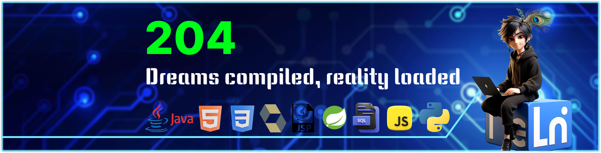

# 💫 About Me:
I am currenty building ecommerce website using Spring Boot

## 🌐 Socials:
   

# 💻 Tech Stack:
                              

### ✍️ Random Dev Quote

---

<!-- Proudly created with GPRM ( https://gprm.itsvg.in ) -->
